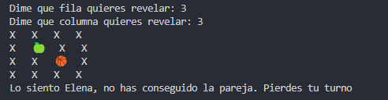

# **CouplesGames 🎴**

*Creado por Elena López Félix, 2º CFGS DAM 📝*

## 🧩 Composición
Está compuesto por 4 clases:

- 🎲 **Board**: Clase que representa el tablero
- 🎮 **Player**: Clase que representa a un jugador
- ⚙️ **Engine**: Clase que representa el flujo del juego
- 🚀 **Main**: Clase que inicializa el juego

## 🎯 ¿Cómo jugar?
El juego comienza con un conjunto de cartas colocadas boca abajo en una
cuadrícula. Cada carta tiene una pareja idéntica, pero su ubicación es desconocida para los
jugadores. En cada turno, el jugador selecciona dos cartas para voltearlas. Si las cartas son
iguales, el jugador las retira del tablero y puede seguir jugando. Si las cartas no coinciden,
se vuelven a colocar boca abajo y pasa el turno al siguiente jugador. El proceso se repite
hasta que se descubren todas las parejas.

## 🎮 Modos de juego
1. 👥 **Persona vs Persona**
2. 🤖 **Persona vs CPU**
3. 🤖🤖 **CPU vs CPU**

### 👥 Persona vs Persona
Dos jugadores compiten por encontrar el mayor número de
parejas. Alternan turnos y el ganador es quien descubra más parejas.

### 🤖 Persona vs CPU
Un jugador humano compite contra una máquina. La máquina
simula una inteligencia artificial básica, recordando las cartas que ha visto para
maximizar sus posibilidades de éxito.

### 🤖🤖 CPU vs CPU
Dos instancias de la máquina juegan entre sí, tomando
decisiones basadas en la memoria de cartas vistas, sin intervención humana.

---
## Ejemplo de juego
